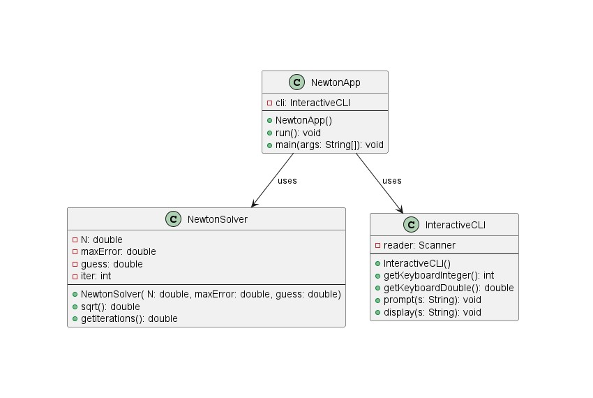

# Newton report
Author: Tejpreet Bal

## UML class diagram

## Execution and Testing
Screenshot demonstrating successful execution and outputs for at least 3 numbers. 

Explain why you chose these numbers for your test.

