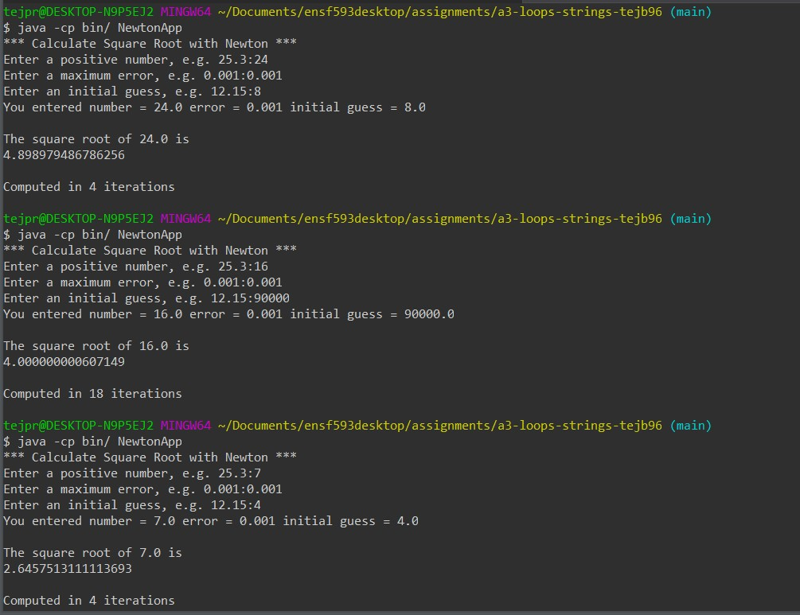

# Newton report
Author: Tejpreet Bal

## UML class diagram

## Execution and Testing

How to run the program: To run from command line, first compile with javac -sourcepath src/ -d bin/ src/NewtonApp.java and run with java -cp bin/ NewtonApp. See screenshot below for an example terminal session.

Alternatively, in Eclipse, right-click on NewtonApp.java in the Package Explorer and select Run As->Java Application.

Screenshot demonstrating successful execution and outputs for at least 3 numbers. 

Explain why you chose these numbers for your test.

I chose 24 and 8 for the first test because those were Kobe Bryant's jersey numbers in the NBA. 

For the second test I choose 16 so a calculator is not required to see the accuracy and guessed 90, 000 to show the capabilities of the program. It only took 16 iterations.

For the third test I chose 7 because it is Ronaldo's jersey number.