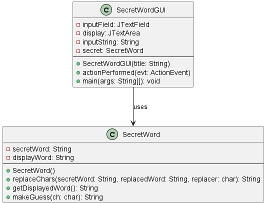
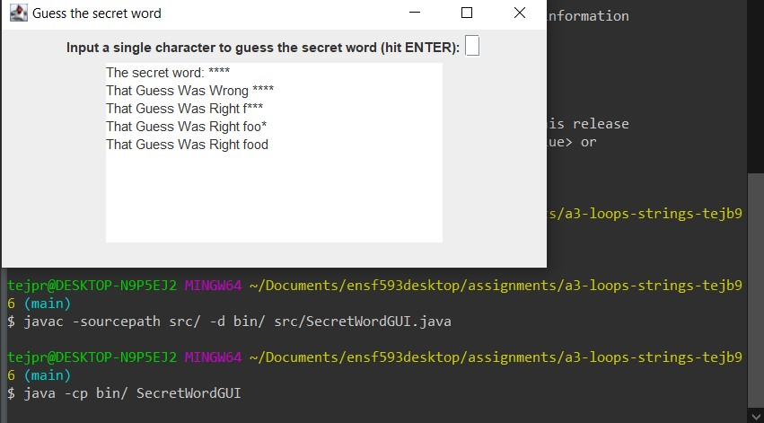

# SecretWord report
Author: Tejpreet Bal

## UML class diagram

## Execution and Testing
How to run the program: To run from command line, first compile with javac -sourcepath src/ -d bin/ src/SecretWordGUI.java and run with java -cp bin/ SecretWordGUI. See screenshot below for an example terminal session.

Alternatively, in Eclipse, right-click on SecretWordGUI.java in the Package Explorer and select Run As->Java Application.

# Reflection

For the SecretWord section, my UML diagram had mistakes when I started to code therefore it took much longer to complete the SecretWord class. I had to make many changes to ensure it met the specification. 

